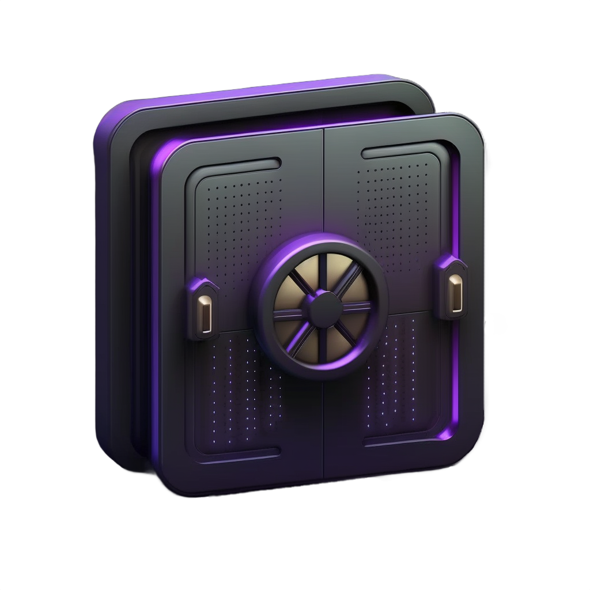

<a name="readme-top"></a>

<div align="center">
 
<h3>PragNAStic</h3>
<p><b>Network-attached storage with integrated backup</b><br/>
Safe • Secure • Flexible</p>
</div>

## Overview

PragNAStic is a network-attached storage solution (NAS) for home or small office use with an emphasis on safety and security – while keeping it simple. Simple as in: off-the-shelf hardware and straightforward operation.

<p align="center"></p>

Users have access to their own network drive, a shared network drive, and a *SyncDrive*, which, similar to Google Drive, synchronizes files between a local directory and the server for offline availability:

<p align="center"></p>

## Features

- **Flexibility** - three "types" of drives:
  - **SyncDrive:** local directory that's synced every minute with the server and is available offline (pretty much like Google Drive), also supports syncing with multiple computers (Windows and macOS supported)
  - **NetDrive:** classic network drive (only available when connected)
  - **SharedDrive:** like NetDrive, but shared between all users
- **Safety through redundancy and backups**
    - two powered USB hubs, each connecting one data disk and one backup disk
    - two data disks operating as an encrypted RAID 1 (mirroring)
    - two backup disks, each containing an independant encrypted backup repo
        <!-- - makes it easy to create multiple copies of a backup: just copy the repo directory -->
    - backups repos are synced
- **Security**
  - all connections secured through SSH
  - backup repos are encrypted
  - data disks are encrypted
- **Email notifications**
  - when backups fail
  - when data volumes are degraded
- **Pragmatic**
  - no frills, bells, or whistles, but gets the job done
  
<!-- - server scripts written for OpenBSD -->
  
### Backups

- scope
    - all data (NetDrives, SyncDrives, SharedDrive)
    - select server directories
- data backups run every 10 minutes
    - backup to primary, fallback to secondary
    - prune backup repos
    - sync backup repos
- saving space (and time)
    - backups are incremental
    - backup repos are pruned after every backup run
- backup retention for data
    - all 10 min snapshots for the past hour
    - hourly snapshots for the past 24h
    - daily snapshots for the past week
    - weekly snapshots for the past month
    - monthly snapshots for the past year
    - all yearly snapshots
- backup retention for server directories: last 30 daily backups

<p align="right">(<a href="#readme-top">back to top</a>)</p>

## Installation

While operation is supposed to be straightforward, installation still involves a few non-trivial steps. Knowledge of Unix-like operating systems and network configuration is required.

A few general notes:

- Give the server that runs PragNAStic a fixed IP address. It avoids headaches.
- A server connected to your router or gateway via an ethernet cable will be faster and won't compete for wifi bandwidth.

<!-- - If you want to receive email notifications then you will need to configure your server's primary mail system accordingly. On OpenBSD that's by default `smtpd`, but any alternative system that allows PragNAStic to send email via the `mail` command is fine. -->

<!-- 2BContinued -->

### Server configuration

The server-side part of PragNAStic can be run on FreeBSD or OpenBSD, with slight nuances in how data volumes are managed: on **FreeBSD** ZFS is used with a mirrored RAID 1 for data, and on **OpenBSD** RAID 1 mirroring is achieved using softraid. If you have the choice: go with the FreeBSD/ZFS combo.

- [Server setup with FreeBSD (recommended)](docs/README-server-freebsd.md)
- [Server setup with OpenBSD](docs/README-server-openbsd.md)

<p align="right">(<a href="#readme-top">back to top</a>)</p>

## Setting up clients

PragNAStic provides scripts for macOS and Windows to:

- mount and unmount NetDrive and SharedDrive
- synchronize SyncDrive

macOS and Windows only (for now) ... all you others on different operating systems will probably know what to do. :-P

The scripts make use of Unison and SSHFS. The [installation instructions for Unison](https://github.com/bcpierce00/unison/wiki/Downloading-Unison) will tell you what you need to do, depending on whether you are on macOS or Windows. Instructions for installing SSHFS for your operating system are given below in the respective OS section.

### macOS

All macOS scripts read what they need to know from a config file `~/.pragnastic.conf` in your home directory. Here's the sample from `client/macos/pragnastic.conf`:

```
netdrive_remote=alice@example.com:/vol/data/alice/netdrive
netdrive_local=~/NetDrive
shareddrive_remote=alice@example.com:/vol/data/shared
shareddrive_local=~/SharedDrive

syncdrive_lockfile=~/.pragnastic.syncdrive.lock
unison_executable=/usr/local/bin/unison
unison_profile=alice
lockfile_age_notification_threshold=120  # 2 mins (notifications currently only work on macOS)
```

You might notice that the location of a user's SyncDrive is not configured in there: that is because SyncDrive uses [Unison](https://github.com/bcpierce00/unison) to synchronize remote and local directories, and Unison reads that kind of information from a Unison profile. The config file above will have Unison use profile `alice`, which means it expects to find the file `~/.unison/alice.prf`.

Look at some sample profiles in `client/conf/unison` as well as [Unison's excellent documentation](https://www.cis.upenn.edu/~bcpierce/unison/download/releases/stable/unison-manual.html) to create your Unison profile, then copy the file to `~/.unison` and don't forget to update the `unison_profile` variable in `~/.pragnastic.conf` accordingly.

**Prerequisites: local directories, Unison configuration, SSHFS**

The commands below will create directories for SyncDrive, NetDrive, and SharedDrive as well as copy the `common` configuration for Unison:

```sh
$ cd ~
$ mkdir {SyncDrive,SharedDrive,NetDrive}
$ mkdir .unison
$ cp location/of/pragnastic/client/conf/unison/common .unison
# ... and don't forget to add your Unison profile to ~/.unison
```

Next, download macFUSE and SSHFS from the [macFUSE homepage](https://osxfuse.github.io/) and install both.

**SyncDrive**

On macOS, SyncDrive is run via `cron`. There is a sample `crontab` in `client/macos/crontab`:

```text
PRAGNASTIC_CLIENT_DIR=/some/path/to/pragnastic/client/macos
* * * * * $PRAGNASTIC_CLIENT_DIR/pragnastic-syncdrive.sh >>$HOME/.pragnastic.syncdrive.log 2>&1
```

Adjust `PRAGNASTIC_CLIENT_DIR` variable as needed and use `crontab -e` to install it.

Setting it up like this will have SyncDrive keep a log file in `~/.pragnastic.syncdrive.log`.

SyncDrive will skip synchronization if the lock file already exists. Sometimes synchronization runs can last longer than a minute, therefore this will happen occasionally. After a certain amount of time, per default 2 minutes, SyncDrive will display a notification on the desktop though, just so you know that something is slightly out of the ordinary. You can change how long to wait before showing a notification with variable  `lockfile_age_notification_threshold` in `~/.pragnastic.conf`.

**NetDrive and SharedDrive**

Since you configured the remote and local locations of those drives in `~/.pragnastic.conf` you can simply run the following to mount NetDrive and SharedDrive:

```sh
$ client/macos/pragnastic-mount-drives.sh
```

Unmount both drives:

```sh
$ client/macos/pragnastic-unmount-drives.sh
```

Two things to note here:

- You could add `pragnastic/client/macos` to your `PATH` environment variable if you mount and unmount drives frequently.
- You could run these scripts at login and logout / restart / shutdown.

### Windows

Open Command Prompt as administrator and checkout PragNAStic's GitHub repository into your `C:\Program Files` directory:

```
C:\...> cd "\Program Files"
C:\...> git clone https://github.com/thndrbrrr/pragnastic.git
```

Now open Command Prompt as a regular user to create PragNAStic's configuration directory, place the `pragnastic-conf.bat` configuration file in there, and then open Notepad to edit the file:

```
C:\...> mkdir %HOMEPATH%\AppData\Local\PragNAStic
C:\...> copy "\Program Files\PragNAStic\client\windows\pragnastic-conf.bat" %HOMEPATH%\AppData\Local\PragNAStic
C:\...> notepad %HOMEPATH%\AppData\Local\PragNAStic\pragnastic-conf.bat
```

All Windows scripts read what they need to know from this very config file `%HOMEPATH%\AppData\Local\PragNAStic\pragnastic-conf.bat`, which, when copied from the repository, looks like this:

```
@ECHO OFF

SET NETDRIVE_LOCAL=N:
SET NETDRIVE_REMOTE=\sshfs.kr\alice@example.com/vol/data/alice/netdrive

SET SHAREDDRIVE_LOCAL=S:
SET SHAREDDRIVE_REMOTE=\sshfs.kr\alice@example.com/vol/data/shared

SET UNISON_EXECUTABLE=C:\"Program Files"\Unison\bin\unison.exe
SET UNISON_PROFILE=alice
```

Change the user names and paths to match your user name on the PragNAStic server.

**Prerequisites: local directories, Unison configuration, SSHFS**

Download the latest SSHFS release from the [SSHFS-Win](https://github.com/winfsp/sshfs-win) homepage and install it.

Create a `SyncDrive` and a `.unison` directory in your home folder:

```
C:\...> mkdir %HOMEPATH%\SyncDrive
C:\...> mkdir %HOMEPATH%\.unison
```

**SyncDrive**

Create a Unison profile (`client\conf\unison\alice.prf` is an example for Windows) and put it, along with `client\conf\unison\common`, into your `%HOMEPATH%\.unison` folder.

Update the Unison profile name in variable `UNISON_PROFILE` in `%HOMEPATH%\AppData\Local\PragNAStic\pragnastic-conf.bat`, and possibly also where the Unison executable is located in case you didn't install it in `C:\Program Files\Unison`.

Launch Task Scheduler and create a task that runs `C:\Program Files\PragNAStic\client\windows\pragnastic-syncdrive.bat` once every minute. (Note: screenshots to follow)

> 👉 If you have never logged into your PragNAStic server through SSH then you might have to start SyncDrive once from the Command Prompt, during which SSH will ask you to confirm that you actually want to connect to your PragNAStic server. (You'll only have to do this once.)

... 2BContinued ...

**NetDrive and SharedDrive**

Mount NetDrive and SharedDrive, which should show up as volumes `N:` and `S:` in File Explorer, respectively:

```
C:\...> "C:\Program Files\PragNAStic\client\windows\pragnastic-mount-drives.sh"
```

Unmount NetDrive and SharedDrive:

```
C:\...> "C:\Program Files\PragNAStic\client\windows\pragnastic-unmount-drives.sh"
```

> 👉 You can change the drive letters used by NetDrive and SharedDrive in your PragNAStic configuration file (`%HOMEPATH%\AppData\Local\PragNAStic\pragnastic-conf.bat`).

Windows with SSHFS-Win is pretty good at restoring server connections to remote drives after a reboot. However, if you are running into issues then you could use Task Scheduler to create a task that calls the above scripts to mount the drives when logging in and unmount them when logging out, rebooting, or shutting down.

<p align="right">(<a href="#readme-top">back to top</a>)</p>

## Contributing

Contributions are what make the open source community such an amazing place to learn, inspire, and create. Any contributions you make are **greatly appreciated**. If you have a suggestion that would make this better, please fork the repo and create a pull request. Thank you!

1. Fork the project
2. Create your feature branch (`git checkout -b feature/amazing-feature`)
3. Commit your changes (`git commit -m 'Adding some amazing feature'`)
4. Push to the branch (`git push origin feature/amazing-feature`)
5. Open a pull request

<p align="right">(<a href="#readme-top">back to top</a>)</p>

## License

Distributed under the ISC license. See [`LICENSE`](LICENSE) for more information.

<p align="right">(<a href="#readme-top">back to top</a>)</p>

## Contact

Mail: thndrbrrr@gmail.com

Mastodon: [@thndrbrrr@hachyderm.io](https://hachyderm.io/@thndrbrrr)

<p align="right">(<a href="#readme-top">back to top</a>)</p>

## Acknowledgments

In the end, everyone stands on the shoulders of giants.

* [Unison File Synchronizer](https://github.com/bcpierce00/unison)
* [Restic](https://restic.net/)
* [OpenSSH](https://www.openssh.com/)
* [macFUSE](https://osxfuse.github.io/)
* [SSHFS](https://github.com/osxfuse/sshfs)
* [SSHFS-Win](https://github.com/winfsp/sshfs-win)
* [FreeBSD](https://www.freebsd.org/)
* [OpenBSD](https://www.openbsd.org/)
* [Stack Overflow](https://stackoverflow.com/)
* [Reddit's /r/homelab](https://www.reddit.com/r/homelab/)
* Readme based on a template by [Othneil Drew](https://github.com/othneildrew)

<p align="right">(<a href="#readme-top">back to top</a>)</p>

--------

<div align="center">
Copyright (c) 2023 <a href="mailto:thndrbrrr@gmail.com">thndrbrrr</a>
</div>
