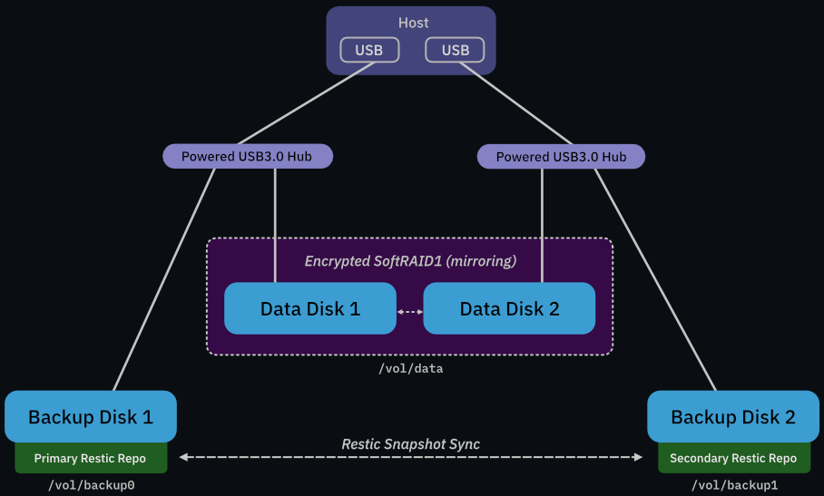

# pragnastic

<h1>PragNAStic<h1>
<h2>Safe • Secure • Pragmatic</h2>
<h3>Network-attached storage with integrated backups</h3>

## Features

- **Redundancy**
    - two data disks operating as an encrypted RAID 1 (mirroring)
    - two backup disks, each containing an independant encrypted backup repo
        <!-- - makes it easy to create multiple copies of a backup: just copy the repo directory -->
    - two powered USB hubs, each connecting one data disk and one backup disk
    - backups are synced between repos
 - **Flexibility** - three types of drives:
     - **SyncDrive:** a local directory that's synced every minute with the server and is available offline (pretty much like Google Drive), also supports syncing with multiple computers (client scripts for Windows and macOS)
    - **NetDrive:** classic network drive (only available when connected)
    - **SharedDrive:** like NetDrive, but shared between all users
- **Email notifications**
    - when backups fail
    - when data RAID is degraded
- **Security**
  - all connections secured through SSH
  - server scripts assume to be run on OpenBSD
  

### Backups

- scope
    - all data (NetDrives, SyncDrives, SharedDrive)
    - select directories on the server 
- saving space (and time)
    - backups are incremental
    - backup repos are pruned after every backup run
- backup schedule: every 10 minutes
    - backup to primary, fallback to secondary
    - prune backup repos
    - sync backup repos
- backup retention for data
    - all 10 min snapshots of the last hour
    - all hourly snapshots of the last 24h
    - all daily snapshots of the current week
    - all weekly snapshots of the current month
    - all monthly snapshots of the current year
    - all yearly snapshots
- backup retention for server directories: last 30 daily backups