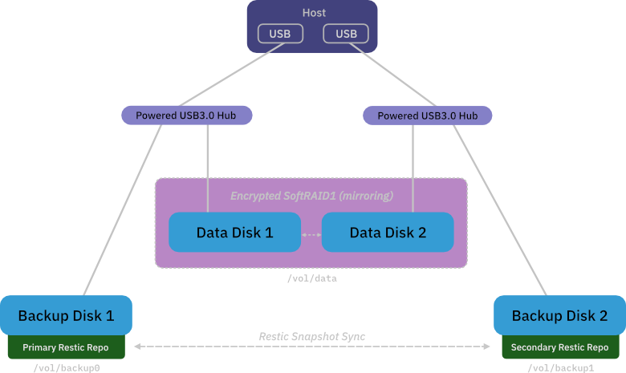
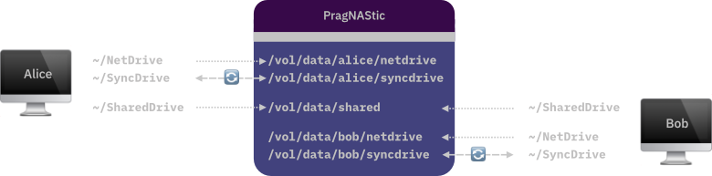

<a name="readme-top"></a>

<div align="center">
 
<h3>PragNAStic</h3>
<p><b>Network-attached storage with integrated backup</b><br/>
Safe • Secure • Flexible</p>
</div>

## Overview

PragNAStic is a network-attached storage solution (NAS) for home or small office use with an emphasis on safety and security – while keeping it simple. Simple as in: off-the-shelf hardware and straightforward operation.

<p align="center"></p>

Users have access to their own network drive, a shared network drive, and a *SyncDrive*, which, similar to Google Drive, synchronizes files between a local directory and the server for offline availability:

<p align="center"></p>

## Features

- **Flexibility** - three "types" of drives:
  - **SyncDrive:** local directory that's synced every minute with the server and is available offline (pretty much like Google Drive), also supports syncing with multiple computers (Windows and macOS supported)
  - **NetDrive:** classic network drive (only available when connected)
  - **SharedDrive:** like NetDrive, but shared between all users
- **Safety through redundancy and backups**
    - two powered USB hubs, each connecting one data disk and one backup disk
    - two data disks operating as an encrypted RAID 1 (mirroring)
    - two backup disks, each containing an independant encrypted backup repo
        <!-- - makes it easy to create multiple copies of a backup: just copy the repo directory -->
    - backups repos are synced
- **Security**
  - all connections secured through SSH
  - server scripts written for OpenBSD
  - backup repos are encrypted
  - data disks are encrypted
- **Email notifications**
  - when backups fail
  - when data RAID is degraded
- **Pragmatic**
  - no frills, bells, or whistles, but gets the job done
  
### Backups

- scope
    - all data (NetDrives, SyncDrives, SharedDrive)
    - select server directories
- data backups run every 10 minutes
    - backup to primary, fallback to secondary
    - prune backup repos
    - sync backup repos
- saving space (and time)
    - backups are incremental
    - backup repos are pruned after every backup run
- backup retention for data
    - all 10 min snapshots within the last hour
    - all hourly snapshots within the last 24h
    - all daily snapshots within the last week
    - all weekly snapshots within the last month
    - all monthly snapshots within the last year
    - all yearly snapshots
- backup retention for server directories: last 30 daily backups

<p align="right">(<a href="#readme-top">back to top</a>)</p>

## Installation

While operation is supposed to be straightforward, the installation still involves a few non-trivial steps. Knowledge of Unix-like operating systems and network configuration is required.

<!-- 2BContinued -->

### Server configuration

A few general notes:

- Give the server that runs PragNAStic a fixed IP address. It avoids headaches.
- A server connected to your router or gateway via an ethernet cable will be faster and won't compete for wifi bandwidth.
- If you want to receive email notifications then you will need to configure your server's primary mail system accordingly. On OpenBSD that's by default `smtpd`, but any alternative system that allows PragNAStic to send email via the `mail` command is fine.

From here on the instructions assume that you are the `root` user on an OpenBSD system.

```sh
# Install required packages
pkg_add restic
pkg_add unison--no_x11
```

### Prepare disks

<!-- All disks will need to be formatted, some will be encrypted -->

**Data disks**

The instructions below create one single RAID partition on each data disk. So for each data disk (`sdX` being the disk's device):

```sh
# erase traces of any previous softraid
dd if=/dev/zero of=/dev/rsdXc bs=1m count=8 

# write GPT
fdisk -g sdX

# write disklabel
echo 'RAID 1M-* 100%' >disklabel_raid_template
disklabel -wAT disklabel_raid_template sdX
```

**Data softraid**

The two data disks now need to be setup to become a single, encrypted RAID 1 volume. RAID 1 means that all data is mirrored between both disks, therefore if one should fail you'll be able to continue using PragNAStic without service interruption.

Use a good password to encrypt your data RAID. Something long like `x21VJiDZMcDUtq5TGPyBQsCdwYGrc89uxGp0X2HY` is a great password, something like `abc123` is not.

In the steps below `sdX` stands for the first data disk, `sdY` for the second data disk, and `sdZ` for the new device that is your RAID (which you'll know after running the `bioctl` command below):

```sh
# create softraid device (bioctl will ask for your password)
bioctl -c 1C -l /dev/sdXa,/dev/sdYa softraid0
# > softraid0: RAID 1C volume attached as sdZ

# clear RAID's first sector
dd if=/dev/zero of=/dev/rsdZc bs=1m count=1

# write GPT
fdisk -g sdZ

# create RAID partition
printf "a\n\n\n\n4.2BSD\nw\nq\n" | disklabel -E sdZ

# format RAID with file system FFS
newfs /dev/rsdZa
```

**Backup disks**

The instructions below create one large partition on each backup disk. Of course you may choose any other layout, but keep in mind that the partition used for backups should be sizeable. A good rule of thumb could be to have your backup disks twice as large as your data disks.

Prepare each backup disk (`sdX` being the disk's device) as follows:

```sh
# write GPT
fdisk -g sdX

# create partition labels
disklabel -Eh sdX
  sdX> z             # delete all partitions
  sdX*> a a          # add partition "a"
  offset: [...]      # min sector
  size: [...]        # max sector
  FS type: [4.2BSD]  # file system
  sdX*> q            # quit and write disk labels

# format disk with FFS
newfs /dev/rsdXa
```

### Install PragNAStic

The easiest way to install PragNAStic is to use the `install.sh` script. It will ask you some configuration questions, put all scripts and config files in the right locations, and setup your `/vol` directory.

```sh
# get PragNAStic
git clone https://github.com/thndrbrrr/pragnastic
cd pragnastic/server

# find out ids of each disk
sysctl hw.disknames
# > hw.disknames=sd0:0e9ff5fd5a57d42c,sd1:af86c1eb22937213,sd2:48c10d87b7518288,
# > sd3:a8277f65926ca1e8,sd5:b02ae07832e96c3b,sd4:f4dca823fb31f14e

# Run install
./install.sh
# > backup0 disk id: a8277f65926ca1e8
# > backup1 disk id: b02ae07832e96c3b
# > backup repo password (input is not shown): 
# > data0 disk id: af86c1eb22937213
# > data1 disk id: 48c10d87b7518288
# > data RAID password (input is not shown): 
# > notification recipient's email (leave empty to disable): alice@example.com
# > 
# > Installing PragNAStic with this config:
# >   backup0 disk id: a8277f65926ca1e8
# >   backup1 disk id: b02ae07832e96c3b
# >   backup repo password: ****
# >   data0 disk id: af86c1eb22937213
# >   data1 disk id: 48c10d87b7518288
# >   data RAID password: ****
# >   notification recipient: alice@example.com
# > Proceed? [y/N] y
# > done
```

**Cron jobs**

Three cron jobs are needed to run PragNAStic:

- data backup job, running every 10 minutes
- server backup job, running once nightly
- RAID status check, running every minute

Sample entries can be found in `server/conf/crontab`, and if you've installed PragNAStic in the default location and are using the default location `/vol` for mounting drives then you can just copy-paste that into `root`'s `crontab`, or append it like so:

```sh
# pipe current crontab into a temporary file
$ doas crontab -l >tmp_crontab

# append PragNAStic cron jobs
$ cat server/conf/crontab >>tmp_crontab

# install updated crontab
$ doas cronab tmp_crontab
```

**Note:** It is recommended to install the cron jobs only once you've verified that things are working as expected. Therefore read on through the usage section below, mount the drives, perform a backup as well as a RAID check using the `pragnastic` command, and *then* install the cron jobs.


## Usage

It's a good idea to provide a non-root user with permissions to run `pragnastic` using `doas`:

```sh
echo "permit persist alice as root cmd pragnastic" >>/etc/doas.conf
```

The `pragnastic` command can be used to:

- backup a directory and optionally prune backup repo
- check status of data softraid
- mount and unmount drives
- display various information such as:
  - PragNAStic log
  - remaining free space on disks 
  - list of snapshots in a backup repo
  - contents of a snapshot

```sh
$ pragnastic
# > usage: pragnastic backup backup_path [unison_pruning_opts]
# >        pragnastic mount all|backup|data
# >        pragnastic raidcheck
# >        pragnastic show log|softraid|volumes
# >        pragnastic show snapshot snapshot_id
# >        pragnastic show snapshots [primary|secondary]
# >        pragnastic unmount all|backup|data
```

Mount data drive and backup drives:

```sh
$ doas pragnastic mount all
# > disk backup0 found at /dev/sd3a
# > disk backup1 found at /dev/sd5a
# > /dev/sd3a mounted on /vol/backup0 OK
# > /dev/sd5a mounted on /vol/backup1 OK
# > disk data0 found at /dev/sd1a
# > disk data1 found at /dev/sd2a
# > softraid /dev/sd4a created with chunks /dev/sd1a and /dev/sd2a
# > /dev/sd4a mounted on /vol/data OK
```

Unmount all drives:

```sh
$ doas pragnastic unmount all
# > /vol/data unmounted OK
# > softraid sd4 detached OK
# > /vol/backup0 unmounted OK
# > /vol/backup1 unmounted OK
```
... 2BContinued ...

## Setting up clients

Scripts are provided to mount and unmount NetDrive and SharedDrive as well as synchronize the SyncDrive. All scripts rely on the config file `~/.pragnastic.conf` in your home directory. Here's the sample you can find in `client/conf/pragnastic.conf`:

```
netdrive_remote=alice@example.com:/vol/data/alice/netdrive
netdrive_local=~/NetDrive
shareddrive_remote=alice@example.com:/vol/data/shared
shareddrive_local=~/SharedDrive

syncdrive_lockfile=~/.pragnastic.syncdrive.lock
unison_executable=/usr/local/bin/unison
unison_profile=alice
lockfile_age_notification_threshold=120  # 2 mins (notifications currently only work on macOS)
```

You might notice that the location of the user's SyncDrive is not configured in there: that is because SyncDrive uses [Unison](https://github.com/bcpierce00/unison) to synchronize remote and local directories, and Unison reads that kind of information out of a Unison profile. The config file above will have Unison use profile `alice`, which means it expects to find the file `~/.unison/alice.prf`.

Look at some sample profiles in `client/conf/unison` as well as [Unison's excellent documentation](https://www.cis.upenn.edu/~bcpierce/unison/download/releases/stable/unison-manual.html) to create your Unison profile, and don't forget to update the `unison_profile` variable in `~/.pragnastic.conf` accordingly.


### macOS

The commands below will create the directories, and copy the `common` configuration for Unison:

```sh
$ cd ~
$ mkdir {SyncDrive,SharedDrive,NetDrive}
$ mkdir .unison
$ cp location/of/pragnastic/client/conf/unison/common .unison
# ... and don't forget to add your Unison profile to ~/.unison
```

**SyncDrive**

On macOS, SyncDrive is run via `cron`. There is a sample `crontab` in `client/macos/crontab`:

```text
PRAGNASTIC_CLIENT_DIR=/some/path/to/pragnastic/client/macos
* * * * * $PRAGNASTIC_CLIENT_DIR/pragnastic-syncdrive.sh >>$HOME/.pragnastic.syncdrive.log 2>&1
```

Adjust the `PRAGNASTIC_CLIENT_DIR` variable as needed and use `crontab -e` to install it.

Setting it up like this will have SyncDrive keep a log file in `~/.pragnastic.syncdrive.log`.

SyncDrive will skip synchronization if the lock file already exists. Sometimes synchronization runs can last longer than a minute, therefore this will happen from occasionally. After a configurable amount of time (`lockfile_age_notification_threshold` in `~/.pragnastic.conf`), per default 2 minutes, SyncDrive will show a notification on the desktop though, just so you know that something is slightly out of the ordinary.

**NetDrive and SharedDrive**

2BDocumented

### Windows

2BDocumented

## Contributing

Contributions are what make the open source community such an amazing place to learn, inspire, and create. Any contributions you make are **greatly appreciated**. If you have a suggestion that would make this better, please fork the repo and create a pull request. Thank you!

1. Fork the project
2. Create your feature branch (`git checkout -b feature/amazing-feature`)
3. Commit your changes (`git commit -m 'Adding some amazing feature'`)
4. Push to the branch (`git push origin feature/amazing-feature`)
5. Open a pull request

<p align="right">(<a href="#readme-top">back to top</a>)</p>

## License

Distributed under the ISC license. See [`LICENSE`](LICENSE) for more information.

<p align="right">(<a href="#readme-top">back to top</a>)</p>

## Contact

Mail: thndrbrrr@gmail.com

Mastodon: [@torben@mastodon.sdf.org](https://mastodon.sdf.org/@torben)

<p align="right">(<a href="#readme-top">back to top</a>)</p>


## Acknowledgments

In the end, everyone stands on the shoulders of giants.

* [Unison File Synchronizer](https://github.com/bcpierce00/unison)
* [Restic](https://restic.net/)
* [OpenSSH](https://www.openssh.com/)
* [macFUSE](https://osxfuse.github.io/)
* [SSHFS](https://github.com/osxfuse/sshfs)
* [SSHFS-Win](https://github.com/winfsp/sshfs-win)
* [OpenBSD](https://www.openbsd.org/)
* [Stack Overflow](https://stackoverflow.com/)
* Readme based on a template by [Othneil Drew](https://github.com/othneildrew)

<p align="right">(<a href="#readme-top">back to top</a>)</p>

--------

<div align="center">
Copyright (c) 2023 <a href="mailto:thndrbrrr@gmail.com">thndrbrrr</a>
</div>
